# Print Statement

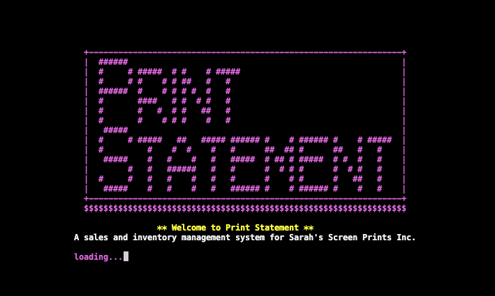

Welcome to Print Statement, a Python command line interface (CLI) application created for a small screen printing business that sells original print creations at a local market. Fully customizable, Print Statement allows users to easily update their print stock and inventory items through intuitive menus and dynamic feedback. Print statement is an efficient interface for artists and can be adapted to meet the unique needs of similar ventures. 

Run the Print Statement program [here](https://print-statement-32b6316d2a47.herokuapp.com/)

Visit associated Google Sheet [here](https://docs.google.com/spreadsheets/d/1du2cyK-pgUHrKHa2XV_88RbtFrG6MvRe8Mn8bJPPdHk/edit?gid=1680754323#gid=1680754323)

## Table of Contents
1. [User Experience (UX)](#user-experience)
    - [Project Goals](#project-goals)
    - [User stories](#user-stories)
    - [Target Audience Goals](#target-audience-goals)
    - [Site Owner Goals](#site-owner-goals)
    - [First Time User Goals](#first-time-user-goals)
    - [Return User Goals](#return-user-goals)
2. [Project Planning](#project-planning)
    - [Process](#process)
    - [Flow Chart](#flow-chart)
    - [Data Model](#data-model)
    - [Structure](#structure)
3. [Design](#design)
    - [Design Philosophy](#design-philosophy)
    - [Design Choices](#design-choices)
4. [Features](#features)
5. [Functions](#functions)
6. [Technologies Utilised](#technologies-utilised)
    - [Languages](#languages)
    - [Frameworks and Programs](#frameworks-and-programs)
7. [Deployment](#deployment)
    - [Version Control](#version-control)
    - [Page Deployment](#page-deployment)
    - [How to Clone](#how-to-clone)
8. [Testing](#testing)
    - [Validation Testing](#validation-testing)
    - [Accessibility](#accessibility)
    - [Manual Testing](#manual-testing)
9. [Bugs and Fixes](#bugs-and-fixes)
10. [Finished Product](#finished-product)
11. [Future Features](#future-features)
12. [Credits](#credits)
    - [Content and Code](#content-and-code)
    - [Media](#media)
13. [Conclusion](#conclusion)
14. [Acknowledgements](#acknowledgements)

## User Experience (UX)

Print Statement is designed with ease of use in mind, ensuring that artists can efficiently manage their operations with minimal effort. Here are some key aspects of the user experience:

**Intuitive Interface**:
   - The command line interface (CLI) is straightforward and user-friendly, allowing users to navigate through the application with simple commands.
   - Clear prompts guide the user through each step of the process, reducing the learning curve.

**Comprehensive Management**:
   - Users can easily track daily print stock, materials and sales, ensuring accurate records of their business activities.
   - Tables are used to organize and retrieve information about specific jobs, providing clarity and organisation.

**Inventory Tracking**:
   - The application keeps detailed records of inventory levels, showing what screen print stock is available and what has been sold.
   - It highlights materials used in the printing process and indicates what needs to be restocked, helping users maintain optimal inventory levels.

**Sales and Forecasting**:
   - By analysing sales data, Print Statement suggests what products might be needed for future markets, aiding in better planning and preparation.
   - This feature helps users make informed decisions about what to print and bring to upcoming markets.

**Customisation**:
   - The application is fully customisable, allowing users to adjust print stock and inventory items as needed, it can also be adapted to suit other artist's businesses.
   - Multiple menus provide options for editing and updating various aspects of the business, ensuring the application remains relevant and useful as the business evolves.

**Efficiency**:
   - Designed to streamline the daily operations of a small screen printing business, Print Statement saves time and reduces administrative burdens.
   - Users can focus more on their creative work and customer interactions, knowing that their operational data is well-organised and easily accessible.

Overall, Print Statement enhances the user experience by providing a reliable, customisable, and efficient tool for managing the key aspects of a small screen printing business.

## Project Goals
- Develop a user-friendly CLI application to assist small screen printing businesses/artists in managing their daily operations.
- Provide comprehensive tools for tracking sales, inventory levels, and material usage.
- Enable businesses to forecast future inventory needs based on sales data.
- Ensure the application is fully customisable to adapt to the evolving needs of the business.

## User Stories
- As a small business owner, I want to easily record and track daily print runs and sales so that I can maintain accurate business records.
- As an inventory manager, I want to monitor material usage and stock levels, so I can ensure we never run out of necessary supplies.
- As a market seller, I want to predict what products will be needed for future markets based on past sales, so I can optimise my stock and increase sales.
- As a new user, I want clear instructions and prompts, so I can quickly learn how to use the application without extensive training.
- As a frequent user, I want customizable options, so I can update my print stock and inventory items as my business changes.

## User Goals
- Efficient operations and inventory management.
- Customisable and intuitive application.
- Accurate records and data-driven decisions.
- Continuous improvement and feedback.
- Clear documentation and support.
- Seamless data management and historical review.

## Project Planning 

### Process 

| **Process**                  | **Details**|
|----------------------------|------------------------------------------------------------------------------------------------------------------------------------------------------------------------------------------------------------|
| **Conceptualisation**      | - **Idea Generation**: Inspired by the need for a streamlined tool for small screen printing businesses. - **Research**: Studied specific needs like inventory management, sales tracking, and forecasting. |
| **Planning**               | - **Defining Project Goals**: Outlined goals focusing on user-friendly design, comprehensive management tools, and customisation. - **User Stories and Target Audience Goals**: Created detailed user stories. |
| **Design**                 | - **Flow Chart Creation**: Used [Lucid Chart](https://www.lucidchart.com/pages) to visualise application structure. - **Data Model Design**: Planned data model for Google Sheets integration. - **Interface Design**: Designed CLI with usability and vibrant colours. |
| **Development**            | - **Setting Up Environment**: Utilised Gitpod for coding and GitHub for version control. - **Implementing Core Features**: Developed print tracking, sales management, inventory tracking, and forecasting. - **Connecting to Google Sheets**: Integrated with Google Sheets using GSpread and OAuth packages. |
| **Testing**                | - **Validation Testing**: Used Pep8 Linter for code validation. - **Accessibility Testing**: Used Lighthouse for accessibility testing. - **Manual Testing**: Performed extensive testing across browsers and devices. |
| **Deployment**             | - **Deploying to Heroku**: Deployed the application on Heroku. - **Version Control**: Used Git for version control with regular commits to GitHub.                                                      |
| **Feedback and Iteration** | - **Gathering User Feedback**: Collected initial user feedback. - **Continuous Improvement**: Implemented enhancements based on feedback.                                                               |

### Flow Chart 

[**Lucid Chart**](https://www.lucidchart.com/pages) was utilised to create the flowchart during the project planning phase.

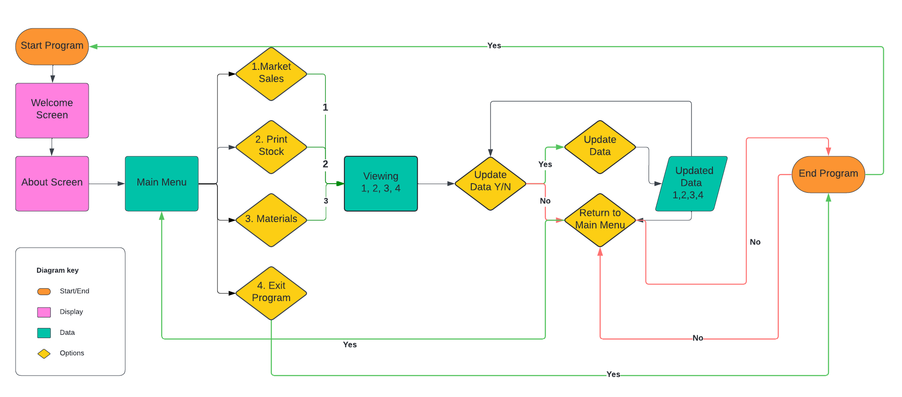

### Data Model 

- **Connecting Google Sheets**

| Steps                                                                 | Details                                                                                                                                                                       |
|----------------------------------------------------------------------------------|-------------------------------------------------------------------------------------------------------------------------------------------------------------------------------|
| Google Drive and Sheets API Setup                                                 | Enabled via Google Cloud Platform.                                                                                                                                            |
| Credentials File Generation                                                      | Generated through the Google Drive API and added to the workspace.                                                                                                            |
| Gitignore Configuration                                                          | Added credentials file to `.gitignore` to prevent sensitive information from being pushed to the repository.                                                                  |
| Permissions Setup                                                               | Added client_email address from credentials file as an editor in Google Sheets to enable access.                                                                               |
| Variable Definition and Scope                                                    | Defined at the top of `run.py` file for accessing the worksheet.                                                                                                              |
| Package Installation                                                            | Installed GSpread and OAuth packages using terminal for interacting with Google Sheets.                                                                                       |

- **Market Sales**

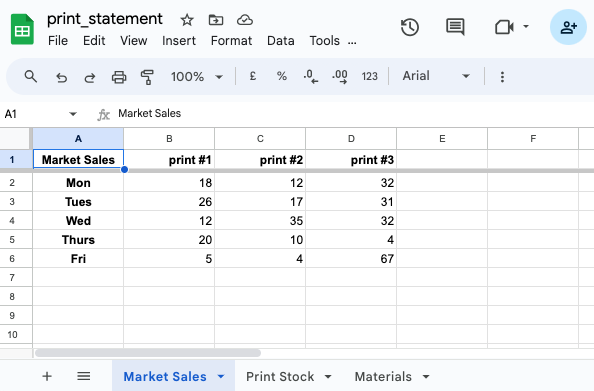

- **Print Stock**

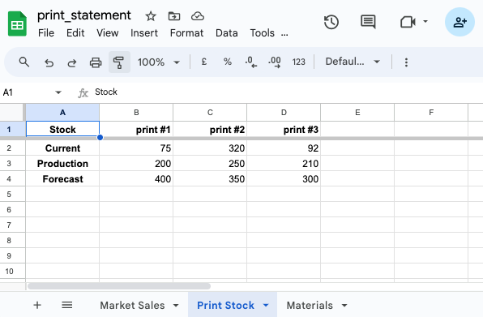

- **Materials**

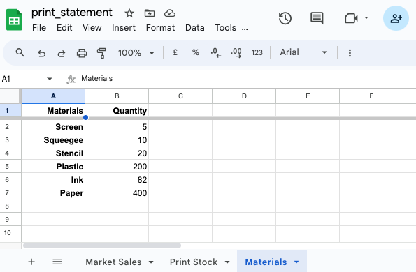

### Structure 

| **Aspect**                  | **Details**                                                                                                                                                                                               |
|-----------------------------|-----------------------------------------------------------------------------------------------------------------------------------------------------------------------------------------------------------|
| **Command Line Interface (CLI)** | - **User Interaction**: The application uses a CLI to facilitate user interaction, making it straightforward for users to input and retrieve data. - **Menu Navigation**: Intuitive menus guide users through different functions, such as tracking print runs, managing inventory, and analysing sales data. |
| **Data Storage**            | - **Google Sheets Integration**: Data is stored in Google Sheets, providing a reliable and accessible way to manage business records. - **Real-time Updates**: Changes made in the application are immediately reflected in the Google Sheets, ensuring up-to-date information. |
| **Data Model**              | - **Structured Data**: Information is organised into tables within Google Sheets, making it easy to read, access and manipulate. - **Relationship Management**: The data model ensures that relationships between different data points (e.g., inventory items and sales records) are maintained. |
| **Functionality**           | - **Print Run Tracking**: Users can log daily print sales, keeping accurate records for future production. - **Inventory Management**: The application tracks inventory levels, usage, and restocking needs. - **Sales Analysis**: Sales data is analysed to forecast future inventory needs and guide business decisions. |
| **Customisation and Flexibility** | - **User-defined Parameters**: Users can customise various aspects of the application to fit their specific business needs, such as adding new prints or adjusting stock levels. - **Scalability**: The structure of the application allows for easy scaling as the business grows, with the ability to add more data points and complexity over time. |
| **Error Handling and Validation** | - **Input Validation**: Ensures that the data entered by users is accurate and in the correct format. - **Error Messages**: Provides clear and helpful error messages to guide users in case of incorrect inputs or other issues. |

## Design 

### Design Philosophy
Print Statement is crafted with a clear and user-centric design philosophy, ensuring that it is both functional and visually engaging. Here are the core principles guiding its design:

- **User-Friendly Interface**: The command line interface (CLI) is designed to be intuitive and straightforward, making it accessible even to users with minimal technical expertise. Clear and concise prompts guide users through each function, reducing the potential for confusion and errors.

- **Visual Appeal**: The application employs bold neon colours (pink, yellow, green, and blue) to create a vibrant and engaging visual experience.
These colours are chosen not only for their aesthetic appeal but also for their ability to enhance readability and highlight important information.

- **Functionality and Efficiency**: The design prioritises functionality, ensuring that users can quickly and easily perform tasks such as tracking prints, managing inventory, and forecasting future needs. Streamlined menus and commands allow for efficient navigation and operation, saving users time and effort.

- **Consistency and Clarity**: Consistent use of colours and design elements helps users quickly learn and recognize different parts of the application.
Information is presented in a clear and organised manner, with important details highlighted to draw attention.

- **Customisability**: While maintaining a clear and consistent design, Print Statement allows for customisation to meet the unique needs of each business. Users can easily update and modify print designs, inventory items, and other data through intuitive menus.

- **Accessibility**: The application is designed to be accessible through the command line, ensuring it can be used on various devices and platforms. The choice of bold colours also aims to enhance accessibility by improving visibility and contrast. By combining a user-friendly interface with vibrant, bold design elements, Print Statement ensures that managing a small screen printing business is both an efficient and enjoyable experience.

### Design Choices
- **Minimalist Layout**: Ensures the focus remains on the necessary information.
- **Responsive Design**: Provides a seamless experience across all devices.
- **Interactive Elements**: Engages users through dynamic feedback.

### Colours

- Utilised bright colours through importing colorama, allowing for vibrancy and intuitive navigation.

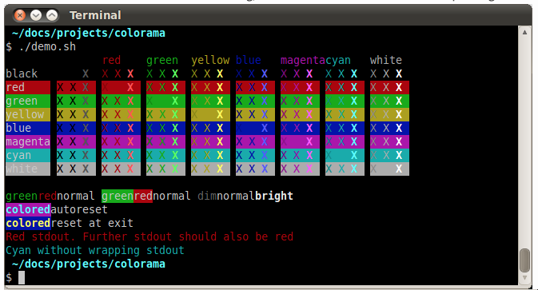

- Magenta utilised for an eye-catching welcome screen banner.
- Green used for menus and successful updates.
- Yellow utilised for loading... and updating messaging.
- Red used for warnings and invalid input.
- White used for general inputting and display.

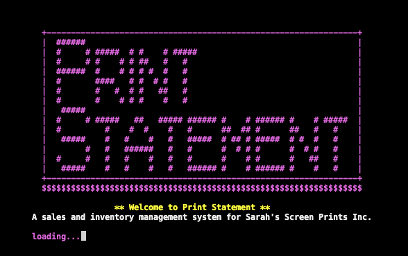

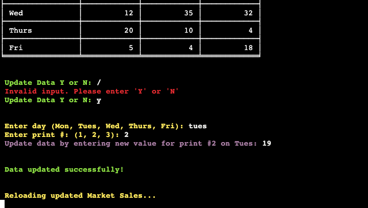

## Features

### User-friendly Command Line Interface (CLI)
- **Interactive CLI**: Provides an easy-to-use interface for interacting with the application.
- **Guided Navigation**: Clear and concise menu options guide users through different functionalities of the application.

### Google Sheets Integration
- **Data Storage**: Utilises Google Sheets for storing and managing business data.
- **Real-time Sync**: Ensures that any updates made via the application are immediately reflected in the Google Sheets.

### Comprehensive Sales Management
- **Market Sales Tracking**: Allows users to view and update daily sales data.
- **Sales Analysis**: Provides insights into sales trends to help make informed business decisions.

### Inventory Management
- **Print Stock Management**: Enables tracking of current, production, and forecasted stock levels.
- **Material Tracking**: Keeps a record of materials used in the screen printing process, ensuring that inventory levels are always up-to-date.

### Data Update Capabilities
- **Flexible Updates**: Users can update sales, stock, and material data directly from the CLI.
- **Error Handling**: Input validation and error messages ensure that the data entered is accurate and correctly formatted.

### Customisation and Scalability
- **Customisable Parameters**: Users can define various parameters to tailor the application to their specific business needs.
- **Scalable Structure**: Designed to accommodate growth, allowing for the addition of new data points and increased complexity over time.

### User Feedback and Assistance
- **Typing Effect for Output**: Enhances the user experience by displaying messages in a typing animation.
- **Colour-coded Messages**: Uses colorama to provide color-coded messages, making it easier for users to distinguish between different types of information and alerts.

### Clear and Informative Display
- **Tabulated Data Display**: Presents data in a clear, tabulated format using the `tabulate` module, making it easy to read and understand.

### Efficient Navigation and Program Flow
- **Main Menu Access**: Allows users to return to the main menu or exit the program at any time.
- **Loading Screens**: Informative loading messages enhance the user experience and provide feedback on the application's status.

### Robust Error Handling
- **Input Validation**: Ensures that users provide valid inputs, reducing the risk of errors and data corruption.
- **Error Messages**: Clear and helpful error messages guide users in case of incorrect inputs or issues.

### Welcome and Exit Messages
- **Welcome Screen**: A visually appealing welcome screen that introduces users to the application.
- **Exit Messages**: Informative exit messages ensure a smooth and user-friendly exit process.

### Developer Convenience
- **Clear Code Structure**: Well-organized code with comments and functions for different tasks, making it easy to maintain and extend.

- **Banner** Logo Banner made to enhance user experience and display name with vibrancy enhancing user experience.

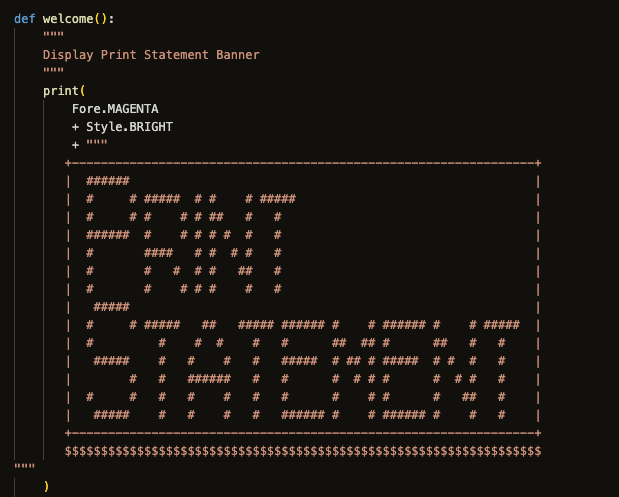

- **Welcome Screen** Welcome user to Print Statement with brief synopsis, typing print and loading... feature.

- **About Screen** Gives user a brief description of the purpose of the program.

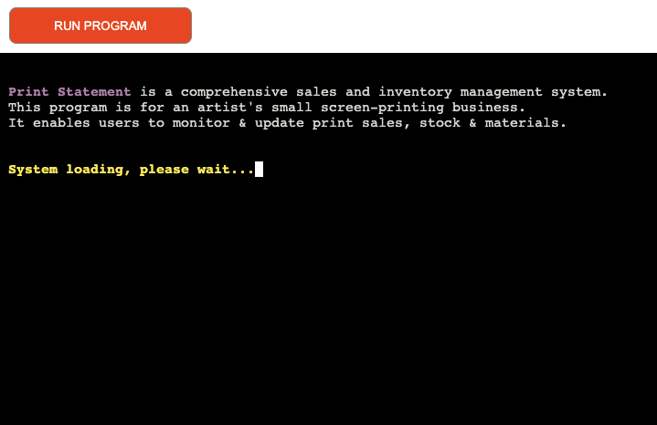

- **Main Menu** Clear Main Menu with numbered options for user to choose to view or update data.

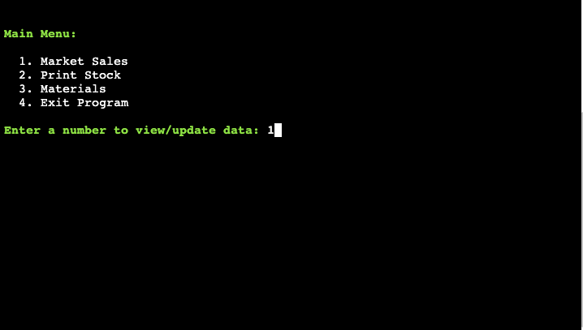

- **Market Sales** Loads Market Sales with table to clearly view data and option to update, return to menu or exit program.

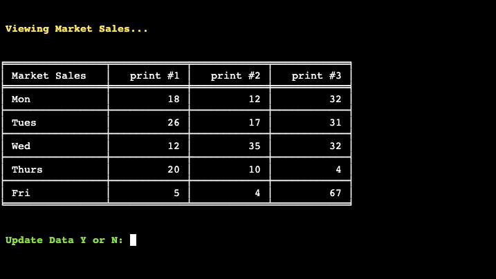

- **Update Sales** Update sales with clear instructions and notification of a successful update, also updates data in google sheet.

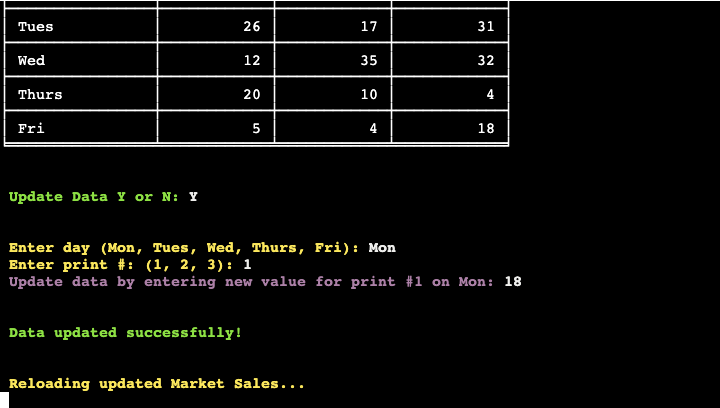

- **Updated Sales** Reloads Market Sales with previous update, clear and concise and option to return to menu or exit program.

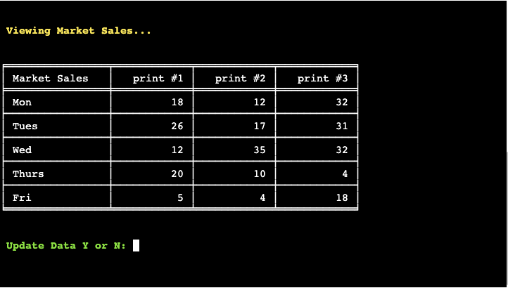

- **Print Stock** Loads Print Stock with table to clearly view data and option to update, return to menu or exit program.

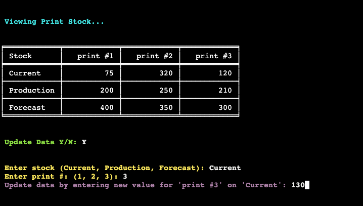

- **Update Print Stock** Update stock with clear instructions and notification of a successful update, also updates data in google sheet.

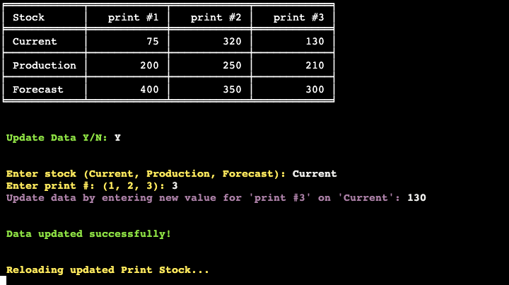

- **Materials** Loads Materials with table to clearly view data and option to update, return to menu or exit program.

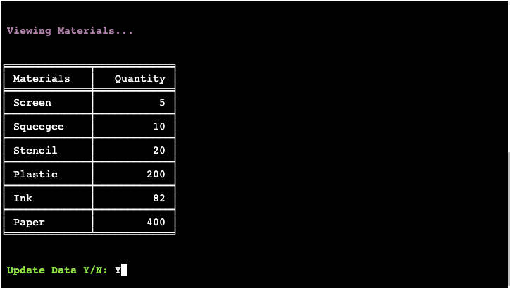

- **Update Materials** Update materials with clear instructions and notification of a successful update, also updates data in google sheet.

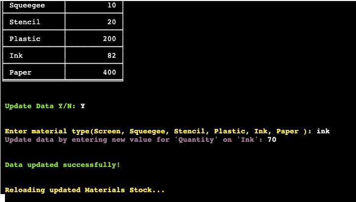

- **Updated Materials** Reloads Materials with previous update, clear and concise and option to return to menu or exit program.

- **Invalid** Comprehensive error messages to display when user inputs incorrect data.

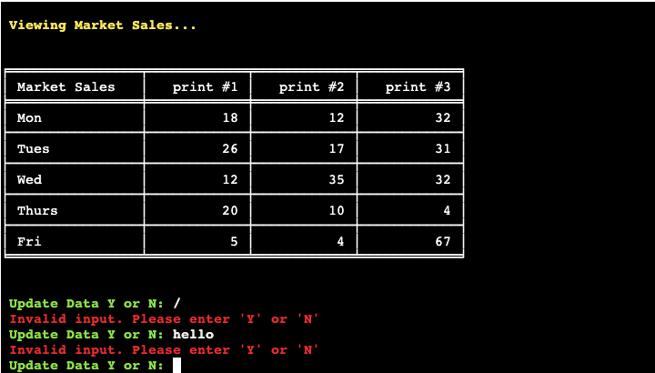

- **Exit Program/Return to Main Menu** User always has option to return to Main Menu or Exit Program.

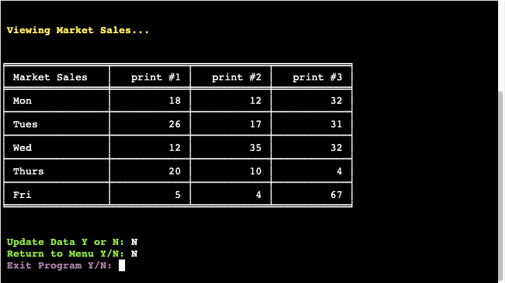

- **Exit Program** User can exit program, for the purposes of project there is a return to intial Welcome Screen.

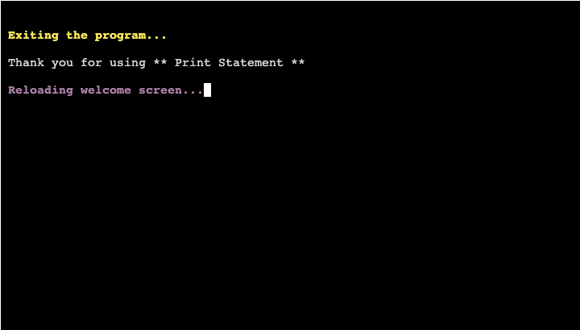

## Functions 

| Function                    | Description                                                                 |
|-----------------------------|-----------------------------------------------------------------------------|
| `welcome()`                 | Displays welcome messages and initializes the program.                      |
| `clearScreen()`             | Clears the screen for better user interface.                                 |
| `options()`                 | Displays the main menu and handles user input for menu selection.            |
| `view_sales("Market Sales")`| Fetches and displays sales data for market sales.                            |
| `view_stock()`              | Fetches and displays stock data.                                             |
| `view_materials()`          | Fetches and displays materials data.                                         |
| `exit_program()`            | Exits the program after displaying exit messages.                            |
| `update_data(sheet, headers)`         | Updates sales data based on user input (print number and day).               |
| `update_stock_data(sheet, headers)`   | Updates stock data based on user input (stock type and print number).        |
| `update_materials_data(sheet, headers)`| Updates materials data based on user input (materials type).               |

**Function Details:**

- **`welcome()`**: Displays initial messages upon program start.
- **`clearScreen()`**: Clears the screen for a cleaner interface.
- **`options()`**: Main menu function allowing user to select various operations.
- **`view_sales("Market Sales")`**: Retrieves and shows sales data specific to market sales.
- **`view_stock()`**: Retrieves and displays current stock information.
- **`view_materials()`**: Retrieves and shows materials data.
- **`exit_program()`**: Handles program termination with appropriate messages.
- **`update_data(sheet, headers)`**: Updates sales data in the specified Google Sheets.
- **`update_stock_data(sheet, headers)`**: Updates stock data in the specified Google Sheets.
- **`update_materials_data(sheet, headers)`**: Updates materials data in the specified Google Sheets.

Each function corresponds to specific actions within your program, facilitating easy navigation and interaction for the user.

## Technologies Utilised 

### Languages

- [**Python3**](https://en.wikipedia.org/wiki/Python_(programming_language))

Provided as part of Code Institute's [Python Essentials Template](https://github.com/Code-Institute-Org/python-essentials-template)

- [**HTML5**](https://en.wikipedia.org/wiki/HTML5)
- [**Javascript**](https://en.wikipedia.org/wiki/JavaScript)

### Frameworks and Programs

- [**Gitpod**](https://www.gitpod.io/) used for writing code, committing, and pushing to GitHub. 
- [**GitHub**](https://github.com/) utilised for hosting, viewing and some readme amendments.
- [**Lucid Chart**](https://www.lucidchart.com/pages) utilised to create the flowchart during project planning.
- [**Heroku**](https://www.heroku.com/home) used to host and deploy the finished project.
- [**PEP8**](https://ww1.pep8online.com/?usid=27&utid=6324189552) was used to validate the Python code.
- [**Colorama**](https://pypi.org/project/colorama/) was used to add colour to the terminal.
- [**Tabulate**](https://pypi.org/project/tabulate/) utilised to form tables for sales, stock and materials data and updates.
- [**GSpread**](https://docs.gspread.org/en/v6.0.0/) utilised to interact with the data in the linked sheet.
- [**Google OAuth**](https://google-auth.readthedocs.io/en/master/reference/google.oauth2.service_account.html) was used to authenticate the program in order to access Google's APIs.
- [**Google Cloud**](https://cloud.google.com/) was used to generate the APIs required to connect the data sheets with the Python code.
- [**Google Sheets**](https://docs.google.com/spreadsheets/u/0/) utilised to store user input data.
- [**Lighthouse**](https://developer.chrome.com/docs/lighthouse/overview) was used to measure the quality of the page.

## Deployment 

Git was used for version control. Version control was done locally and remotely using GitHub.

### Version Control 

- The site was created using Gitpod editor and pushed to Github to the remote repository 'print-statement'.
- Git commands were used throughout the development to push the code to the remote repository. 
- Regular commits were made after changes:
    - git add . used to add the files to the staging area before being committed.
    - git commit -m "commit message" used to commit changes to the local repository queue.
    - git push used to push all committed code to the remote repository on Github.

### Page Deployment 

- The app was deployed with Heroku following these steps:
- After creating a Heroku account, click "New" to create a new app from the dashboard.
- Create a name of the app, that needs to be unique, and select your region. Press "Create app"
- Go to settings and add the necessary Config_vars and buildpacks. Make sure that the buildpacks are set to "Python" and "NodeJS", in that order.
- Go to Deploy tab and scroll down to Deployment Method.
- Select GitHub and search for your GitHub repository.
- Scroll down to deploy options.
- For this project the Manual Deploy method was chosen.
- Choose main branch and click Deploy Branch. This will deploy the current state of the branch specified.
- Now the app is being built and when Deploy to Heroku has a green check mark, the build is finished.
- Click View button to open the app in a browser window.

### How to Clone 

- Go to the Github repository that you want to clone.
- Click on the Code button located above all the project files.
- Click on HTTPS and copy the repository link.
- Open the IDE of your choice and and paste the copied git url into the IDE terminal.
- The project is now created as a local clone.

## Testing 

### Validation Testing 

Pep8 Linter Validation. No errors remain in final testing.

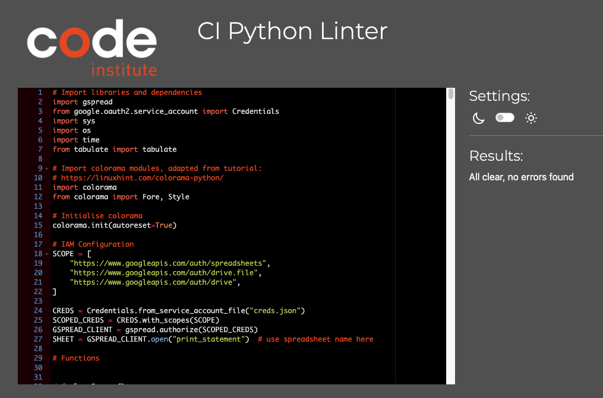

### Accessibility 

Lighhouse Testing

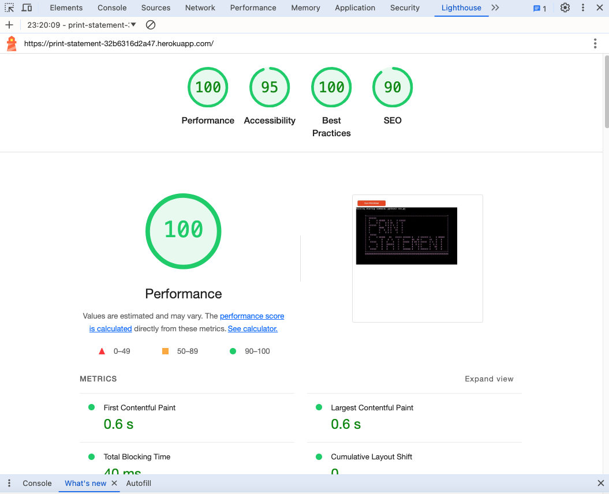
 
### Manual Testing 

Manual testing for the site involves hands-on evaluation by human testers to ensure functionality, usability, and compatibility across various devices and browsers. By conducting the manual testing procedures below, we ensure the program functions smoothly, provides an optimal user experience, and meets desired standards both for navigational and performance testing purposes.

# Manual Test Cases #

| Test ID | Test Description                                                                                        | Expected Result                                                                                  | Status (Pass/Fail) |
|----|---------------------------------------------------------------------------------------------------------|--------------------------------------------------------------------------------------------------|--------------------|
| 1  | **Verify welcome banner and introductory text**                                                         | Welcome banner and introductory text should display correctly with colour formatting.             |   Pass             |
| 2  | **Verify clear screen functionality**                                                                   | The screen should be cleared properly when `clearScreen` is called.                              |   Pass             |
| 3  | **Verify typing effect for `typingPrint`**                                                              | Text should be displayed with a typing effect, with the specified colour.                         |   Pass             |
| 4  | **Verify typing effect for `typeInput`**                                                                | Input prompt should display text with a typing effect.                                           |   Pass            |
| 5  | **Verify main menu options display**                                                                    | Main menu options should be displayed with correct formatting and colours.                        |   Pass             |
| 6  | **Verify invalid menu option handling**                                                                 | Invalid input for the main menu should display an error message and prompt the user again.       |   Pass             |
| 7  | **Verify valid menu option handling**                                                                   | Valid input should navigate to the corresponding section (Market Sales, Print Stock, Materials). |   Pass             |
| 8  | **Verify viewing sales data**                                                                           | Sales data should be fetched from the "Market Sales" sheet and displayed in a table format.      |   Pass             |
| 9  | **Verify updating sales data with valid input**                                                         | Sales data should be updated successfully in the spreadsheet when valid input is provided.       |   Pass             |
| 10 | **Verify handling invalid input for updating sales data**                                               | Invalid input should display an error message and prompt the user again.                         |   Pass             |
| 11 | **Verify viewing stock data**                                                                           | Stock data should be fetched from the "Print Stock" sheet and displayed in a table format.       |    Pass          |
| 12 | **Verify updating stock data with valid input**                                                         | Stock data should be updated successfully in the spreadsheet when valid input is provided.       |  Pass              |
| 13 | **Verify handling invalid input for updating stock data**                                               | Invalid input should display an error message and prompt the user again.                         |   Pass             |
| 14 | **Verify viewing materials data**                                                                       | Materials data should be fetched from the "Materials" sheet and displayed in a table format.     |   Pass             |
| 15 | **Verify updating materials data with valid input**                                                     | Materials data should be updated successfully in the spreadsheet when valid input is provided.   |    Pass            |
| 16 | **Verify handling invalid input for updating materials data**                                           | Invalid input should display an error message and prompt the user again.                         |    Pass            |
| 17 | **Verify exit program functionality**                                                                   | Program should exit and display the exit message when "Exit Program" is selected.                |     Pass          |
| 18 | **Verify return to main menu after updating data in Market Sales section**                              | After updating data in Market Sales, user should be prompted to return to main menu or exit.     |     Pass           |
| 19 | **Verify return to main menu after updating data in Print Stock section**                               | After updating data in Print Stock, user should be prompted to return to main menu or exit.      |    Pass            |
| 20 | **Verify return to main menu after updating data in Materials section**                                 | After updating data in Materials, user should be prompted to return to main menu or exit.        |     Pass           |
| 21 | **Verify Google Sheet is updated accordingly when data is passed**                                      | The connected Google Sheet should reflect the updated data correctly when changes are made.      |   Pass                 |

## Bugs and Fixes 

Throughout the development process, we encountered and resolved various bugs to ensure a smooth and seamless user experience. Our rigorous testing procedures helped identify and address these issues promptly.

# Python Testing Bugs #

| Bug ID | Bug Description                                                                              | Steps to Reproduce                              | Expected Behaviour                                                                | Actual Behaviour                                                                | Fix Description                                                                 | Status (Fixed/Unfixed) |
|---|----------------------------------------------------------------------------------------------|------------------------------------------------|----------------------------------------------------------------------------------|--------------------------------------------------------------------------------|--------------------------------------------------------------------------------|------------------------|
| 1 | **Welcome banner not displaying correctly**                                                  | Run the program | Welcome banner should display correctly with colour formatting.| Welcome banner is not displaying / formatting is incorrect.| Corrected the text formatting and ensured the colour applied properly and colorama installed. | Fixed |
| 2 | **UnboundLocalError: cannot access local variable display_table** |  run.py, input new data  | Table should be displayed with the updated values'get valid_ column _index', and display_table' are defined within the update data function, which restricts their scope. | Program does not handle the display_table properly. | Define these helper functions outside the 'update_ data' function.. | Fixed |
| 3 | **SyntaxError: 'break' outside loop** | run.py up to loop, enter valid and invalid data  | No Syntax error for loop  | Loop logic not working as expected. | Ensure the break statements are correctly placed within the while loop. | Fixed |
| 4 | **Google Sheet not updating correctly after changes**  | run.py, update new data | Make changes to data when updated by user. Google Sheet should reflect the updated data correctly. | Changes are not reflected in the Google Sheet, incorrectly mapping the Google Sheets format.| Fixed the index adjustment for cell_to_update' when referencing Google Sheets cells. Google Sheets uses 1-based indexing for rows and columns, fixed indices. | Fixed |
| 5 | **BRIGHT text working in terminal with colorama but not in browser**  | run.py, use colorama | Make text vibrant | Heroku does not support some colorama features ie BRIGHT text | Fixed  | Fixed |

## Finished Product 

### User-friendly CLI
- **Interactive Menu**: Easy navigation through guided menus.
- **Typing Effect**: Engaging user experience with typing animations.
- **Color-coded Feedback**: Visual distinction for better understanding.

### Google Sheets Integration
- **Real-time Data**: Instant updates and cloud storage for secure data management.

### Sales Management
- **Market Sales Tracking**: View and update daily sales data.
- **Analytics**: Insights into sales performance.

### Inventory Management
- **Print Stock**: Track current, production, and forecasted stock.
- **Materials Monitoring**: Detailed record of screens, squeegees, stencils, plastic, ink, and paper.

### Data Updates
- **Accurate Updates**: Easily update data with input validation.
- **Error Handling**: Robust mechanisms to correct invalid entries.

### User Navigation
- **Main Menu Access**: Return to the main menu or exit anytime.
- **Loading and Exit Screens**: Informative messages guide users through processes.

## Benefits

- **Efficiency**: Reduces manual effort and errors for accurate data.
- **Scalability**: Grows with your business, accommodating new data points.
- **Customization**: Adapts to specific business needs.
- **Enhanced UX**: Intuitive and enjoyable user interface.

## Future Features 

- **Custom Reports**: Generate custom reports for specific time frames and sales metrics.
- **Graphical Analytics**: Visualize data trends with charts and graphs.
- **User Roles**: Implement user roles and permissions for added security.
- **Collaboration Tools**: Allow multiple users to collaborate and update data simultaneously.
- **Online Sales**: Add an online sales feature.

## Credits 

### Content and Code 

* [Code-Institute](https://codeinstitute.net/ie/?nab=0) Walkthrough projects content.
* [MDN](https://developer.mozilla.org/en-US/) Python tutorials.
* [W3 Schools](https://www.w3schools.com/python/) Python tutorials.
* [Codu](https://www.codu.co/) Inspiration.
* [Gitpod](https://www.gitpod.io/) Write, commit and push code to GitHub. 
* [GitHub](https://github.com/) Hosting, amending and viewing code.
* [Heroku](https://www.heroku.com/home) Host and deploy the finished project.
* [GSpread](https://docs.gspread.org/en/v6.0.0/) Interact with the data in the linked sheet.
* [Google OAuth](https://google-auth.readthedocs.io/en/master/reference/google.oauth2.service_account.html) Authenticate the program in order to access Google's APIs.
* [Google Cloud](https://cloud.google.com/) Generate the APIs required to connect the data sheets with the Python code.
* [Google Sheets](https://docs.google.com/spreadsheets/u/0/) Store user input data.
* [Lighthouse](https://developer.chrome.com/docs/lighthouse/overview) Measure the quality of the page.
* [Real Python](https://realpython.com/) Troubleshoot python code.
* [Over API](https://overapi.com/python) Python cheatsheet.
* [PyCheckio](https://py.checkio.org/) Code practice.
* [Python Tutor](https://pythontutor.com/python-compiler.html#mode=edit) Troubleshoot code.
* [PEP8](https://ww1.pep8online.com/?usid=27&utid=6324189552) was used to validate the Python code.

### Media 
* [Colorama](https://pypi.org/project/colorama/) was used to add colour to the terminal.
* [Tabulate](https://pypi.org/project/tabulate/) utilised to form tables for sales, stock and materials data and updates.
* [Lucid Chart](https://www.lucidchart.com/pages) utilised to create the flowchart during project planning.
* [Convertio](https://convertio.co/) Convertio utilised to optimise images for readme.

## Conclusion 
Print Statement is a powerful yet user-friendly CLI application designed to support small screen printing businesses in managing their daily operations efficiently. By providing tools for tracking print runs, sales, inventory levels, and material usage, the application ensures that business owners can maintain accurate records and make informed decisions.

## Acknowledgements 
- Amy Richardson, my course facillitator.
- Rahul Lakahanpal, my mentor.
- [Bakestock](https://github.com/amylour/BakeStock) by amylour for inspiration.
- [Budget Buddy](https://github.com/Sarah-Bue/budget-buddy) by Sarah-Bue for helpful Readme.
- Ozzy the dog, great on breaks.

[🔼 Back to top](#Print-Statement)
